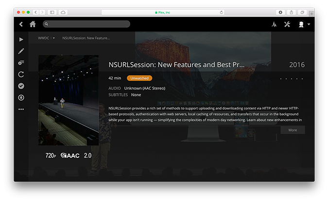

# WWDC Plex Metadata Agent
A Plex agent which provides metadata for [Apple Worldwide Developers Conference](https://developer.apple.com/wwdc/) session videos including titles, dates, summaries, and collection tags.



## Requirements
* An installation of [Plex Media Server](https://www.plex.tv/).
* A folder containing WWDC session videos.

## Installation
1. Download or clone this repository and copy **WWDC.bundle** into your [Plex Plug-ins directory](https://support.plex.tv/hc/en-us/articles/201106098-How-do-I-find-the-Plug-Ins-folder-). E.g.;  

 | Platform | Directory |
 | -------- | --------- |
 | Linux    | /var/lib/plexmediaserver/Library/Application Support/Plex Media Server/Plug-ins/ |
 | macOS    | ~/Library/Application Support/Plex Media Server/Plug-ins/ |
 | Windows  | %LOCALAPPDATA%\Plex Media Server\Plug-ins\ |

2. In your Plex web interface visit **Settings > Server > Agents** and verify that you have a *WWDC* agent listed under *Movies*.
3. Edit or create a new Movies or Home Videos library for a directory with WWDC session videos, and from the *Advanced* tab select the *WWDC* agent.

## File and Folder Structure
For automatic matches, this agent requires the year and session number to be present in the filename or containing folder. The year may appear as a 2 or 4 digit number in either the parent directory or the start of the filename, and the session number must appear as the first 3+ digit, non-year number in the filename e.g.;
```
/2016/805_hd_iterative_ui_design.mp4
/wwdc16/805.mp4
/2016-805.mp4
```
The above examples will be correctly parsed as session number 805, *Iterative UI Design* from WWDC 2016.

## Limitations
* Tech Talks and archival Apple Developer videos are not supported.

## License
WWDC Plex Metadata Agent is copyright David Wake and available under a [MIT license](https://github.com/drmccheese/wwdc-plex-metadata/blob/master/LICENSE).

